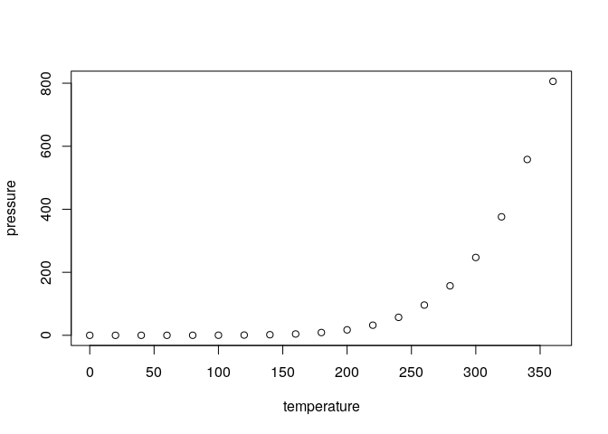

<!-- README.md is generated from README.Rmd. Please edit that file -->

# Rgroup12

<!-- badges: start -->

<!-- badges: end -->

The goal of Rgroup12 is to perform image processing in R.

## Package Overview

`Rgroup12` is a R package that is intended to allow users to compress, sharpen and shrink an input image. 
Our package only allows the input image to be a 3D numpy array and output the manipulated image as a 3D numpy array. It contains three functions: `compress()`, `sharpen()`, and `shrink()`. 


## Feature Description

- `compress`:
  - This function quantizes an image by restricting each pixel to only take on one of the desired colour values
  and return a version of the image (the same size as the original) where each pixel's original colour is replaced with the nearest prototype colour.
  

- `sharpen`:
  - This function enhances the edges in the image and returns a sharper-looking image.  At this moment, this function is restricted to gray-scale images only 
  
- `shrink`:
  - A function that performs vertical seam carve for image shrinking. This function take image input in the form of a matrix.


## Installation

You can install the development version from
[GitHub](https://github.com/) with:

``` r
# install.packages("devtools")
devtools::install_github("UBC-MDS/Rgroup12")
```

## Related Packages

  There are a few existing R packages that perform image manipulation such as [magick](https://cran.r-project.org/web/packages/magick/vignettes/intro.html) and [imager](https://dahtah.github.io/imager/imager.html#resizing-rotation-etc.), which could be used for simplifying high-quantity images. However, these packages are usually very comprehensive and provide many functions to process the image in different ways. There are very few smaller packages available on Github to perform simpler image processing tasks like image shrinking such as [this package](https://github.com/vgorte/SC-Package-R) using seam carving mechanism. Our implementation of image processing is a less sophisticated version of the existing image processing tools, we  focus specifically on image compression, shrinking, and sharpening using simpler and easy to understand algorithms.
  

## Example

This is a basic example which shows you how to solve a common problem:

``` r
library(group12R)
## basic example code
```

What is special about using `README.Rmd` instead of just `README.md`?
You can include R chunks like so:

``` r
summary(cars)
#>      speed           dist       
#>  Min.   : 4.0   Min.   :  2.00  
#>  1st Qu.:12.0   1st Qu.: 26.00  
#>  Median :15.0   Median : 36.00  
#>  Mean   :15.4   Mean   : 42.98  
#>  3rd Qu.:19.0   3rd Qu.: 56.00  
#>  Max.   :25.0   Max.   :120.00
```

You’ll still need to render `README.Rmd` regularly, to keep `README.md`
up-to-date.

You can also embed plots, for example:



In that case, don’t forget to commit and push the resulting figure
files, so they display on GitHub\!
